# DIY #redactionart

The images in this repository are drawn from a collection of #redactionart discovered in ASIO surveillance files held by the National Archives of Australia in 2016. You can explore the [entire collection of #redactionart](https://owebrowse.herokuapp.com/redactions/tags/art/) here.

The story of this discovery [was told on Twitter](https://storify.com/wragge/redaction-art). There's more information in [my research notebook](http://timsherratt.org/research-notebook/projects/immigration-recordkeeping-and-surveillance/), and in [Turning the inside out](https://dx.doi.org/10.6084/m9.figshare.4055013), a keynote I gave to the annual conference of the Australian Society of Archivists in 2016.

In 2017, I exhibited [The Redaction Zoo](https://vimeo.com/wragge/redactionart) as part of 'Beauties and Beasts' at the Belconnen Arts Centre. 

As part of the exhibition, I turned selected images into badges and temporary tattoos.

The SVG files I created are all available in this repository for you to download and use in your own #redactionart projects. 

Full file references are included to enable you to correctly cite each #redactionart image. The image filenames include the file barcode and page number, so you can also use these details to find the originals in the National Archives.

| Page reference | Original image | SVG outline |
|------|------|------|
| [NAA: A6119, 803, p. 15](http://owebrowse.herokuapp.com/items/8334664/pages/15/) | 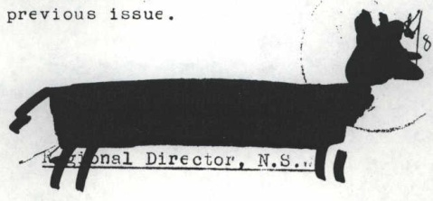 | [8334664-p15.svg](svgs/8334664-p15.svg) |
| [NAA: A6119, 803, p. 36](http://owebrowse.herokuapp.com/items/8334664/pages/36/) | 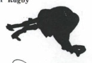| [8334664-p36.svg](svgs/8334664-p36.svg) |
| [NAA: A6119, 860/REFERENCE COPY, p. 63](http://owebrowse.herokuapp.com/items/11599548/pages/63/) | 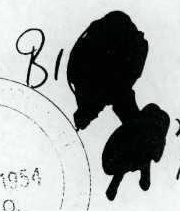 | [11599548-p63.svg](svgs/11599548-p63.svg) |
| [NAA: A6119, 877, p. 22](http://owebrowse.herokuapp.com/items/11981665/pages/22/) | 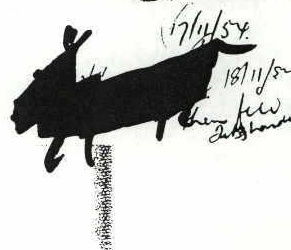 | [11981665-p22.svg](svgs/11981665-p22.svg) |
| [NAA: A6119, 878, p. 42](http://owebrowse.herokuapp.com/items/11981680/pages/42/) | 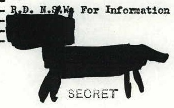 | [11981680-p42.svg](svgs/11981680-p42.svg) |
| [NAA: A6119, 778, p.8](http://owebrowse.herokuapp.com/items/12065786/pages/8/) | 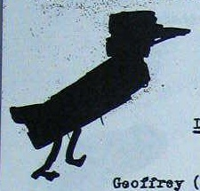 | [12065786-p8.svg](svgs/12065786-p8.svg) |
| [NAA: A6119, 780, p. 64](http://owebrowse.herokuapp.com/items/12065788/pages/64/) | 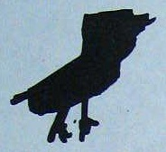 | [12065788-p64.svg](svgs/12065788-p64.svg) |
| [NAA: A6119, 783, p. 53](http://owebrowse.herokuapp.com/items/12065791/pages/53/) | 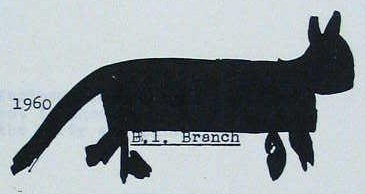 | [12065791-p53.svg](svgs/12065791-p53.svg)|
| [NAA: A6119, 783, p. 95](http://owebrowse.herokuapp.com/items/12065791/pages/95/) | 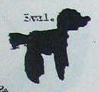 | [12065791-p95.svg](svgs/12065791-p95.svg) |
| [NAA: A6119, 816, p. 14](http://owebrowse.herokuapp.com/items/12123559/pages/14/) | 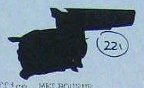 | [12123559-p14.svg](svgs/12123559-p14.svg)|
| [NAA: A6119, 211, p. 192](http://owebrowse.herokuapp.com/items/12141484/pages/192/) | 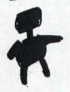 | [12141484-p192.svg](svgs/12141484-p192.svg)|
| [NAA: A6119, 663, p. 6](http://owebrowse.herokuapp.com/items/12249101/pages/6/) |  | [12249101-p6.svg](svgs/12249101-p6.svg) |