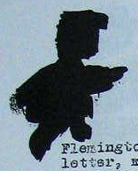

# DIY #redactionart

## The story

The images in this repository are drawn from a collection of #redactionart discovered in ASIO surveillance files held by the National Archives of Australia in 2016. You can explore the [entire collection of #redactionart](https://owebrowse.herokuapp.com/redactions/tags/art/) here.

The story of this discovery [was told on Twitter](http://wke.lt/w/s/mhjyH). There's more information in [Turning the inside out](https://dx.doi.org/10.6084/m9.figshare.4055013), a keynote I gave to the annual conference of the Australian Society of Archivists in 2016.

In 2017, I exhibited [The Redaction Zoo](https://vimeo.com/wragge/redactionart) as part of 'Beauties and Beasts' at the Belconnen Arts Centre.

In 2021, I updated my redaction finder and reprocessed all the available ASIO files, finding some more #redactionart in the process. This is described in [Secrets and lives](https://updates.timsherratt.org/2021/04/21/secrets-and-lives.html), a video I presented at the (Re)Create Symposium.

## The images

By tracing the original JPG images, I've created a series of [SVG files](svgs/). I used these to create badges and temporary tattoos.

All of the SVG images are available in this repository for you to download and use in your own #redactionart projects.

Creative people have already turned \#redactionart into [cookie cutters](https://www.thingiverse.com/thing:2379810), a [dress](https://twitter.com/BonnieWildie/status/874166580900274176), and [iPhone cases, and t-shirts](https://www.redbubble.com/people/misskoko/collections/741004-redactionart). The story of its [escape into the physical world](http://wke.lt/w/s/HOrk1) continues to unfold.

Full file references are included to enable you to correctly cite each #redactionart image. The image filenames also include the file barcode and page number.

To make your own badges, simply upload the SVGs to your preferred laser cutting service. (I used [Online Laser Cutting](https://onlinelasercutting.com.au/)). Of course you can resize them as necessary in a vector graphics editing program.

For the tattoos I used [StrayTats](https://www.straytats.com/). I had to fill in the SVG outline and save as a JPG for upload.

If you make use of these files please share them using the [#redactionart](https://twitter.com/search?q=%23redactionart) tag (you could also star this repository).

**Have fun!**

| Page reference | Original image | SVG outline |
|------|------|------|
| [NAA: A6119, 803, p. 15](http://owebrowse.herokuapp.com/items/8334664/pages/15/) |  | [8334664-p15.svg](svgs/8334664-p15.svg) |
| [NAA: A6119, 803, p. 36](http://owebrowse.herokuapp.com/items/8334664/pages/36/) | | [8334664-p36.svg](svgs/8334664-p36.svg) |
| [NAA: A6119, 860/REFERENCE COPY, p. 63](http://owebrowse.herokuapp.com/items/11599548/pages/63/) |  | [11599548-p63.svg](svgs/11599548-p63.svg) |
| [NAA: A6119, 877, p. 22](http://owebrowse.herokuapp.com/items/11981665/pages/22/) |  | [11981665-p22.svg](svgs/11981665-p22.svg) |
| [NAA: A6119, 878, p. 42](http://owebrowse.herokuapp.com/items/11981680/pages/42/) |  | [11981680-p42.svg](svgs/11981680-p42.svg) |
| [NAA: A6119, 778, p.8](http://owebrowse.herokuapp.com/items/12065786/pages/8/) |  | [12065786-p8.svg](svgs/12065786-p8.svg) |
| [NAA: A6119, 780, p. 64](http://owebrowse.herokuapp.com/items/12065788/pages/64/) |  | [12065788-p64.svg](svgs/12065788-p64.svg) |
| [NAA: A6119, 783, p. 53](http://owebrowse.herokuapp.com/items/12065791/pages/53/) |  | [12065791-p53.svg](svgs/12065791-p53.svg)|
| [NAA: A6119, 783, p. 95](http://owebrowse.herokuapp.com/items/12065791/pages/95/) |  | [12065791-p95.svg](svgs/12065791-p95.svg) |
| [NAA: A6119, 816, p. 14](http://owebrowse.herokuapp.com/items/12123559/pages/14/) |  | [12123559-p14.svg](svgs/12123559-p14.svg)|
| [NAA: A6119, 211, p. 192](http://owebrowse.herokuapp.com/items/12141484/pages/192/) |  | [12141484-p192.svg](svgs/12141484-p192.svg)|
| [NAA: A6119, 663, p. 6](http://owebrowse.herokuapp.com/items/12249101/pages/6/) |  | [12249101-p6.svg](svgs/12249101-p6.svg) |
| [NAA: A6119, 778, p.55](http://owebrowse.herokuapp.com/items/12065786/pages/55/) |  | [12065786-p55.svg](svgs/12065786-p55.svg) |
